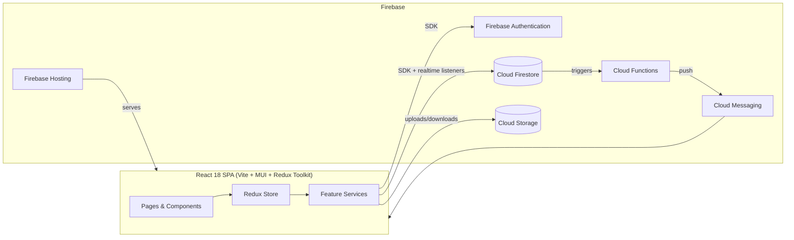
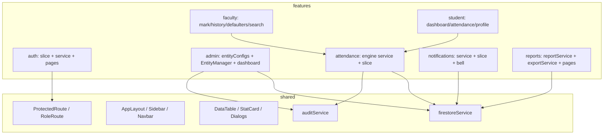
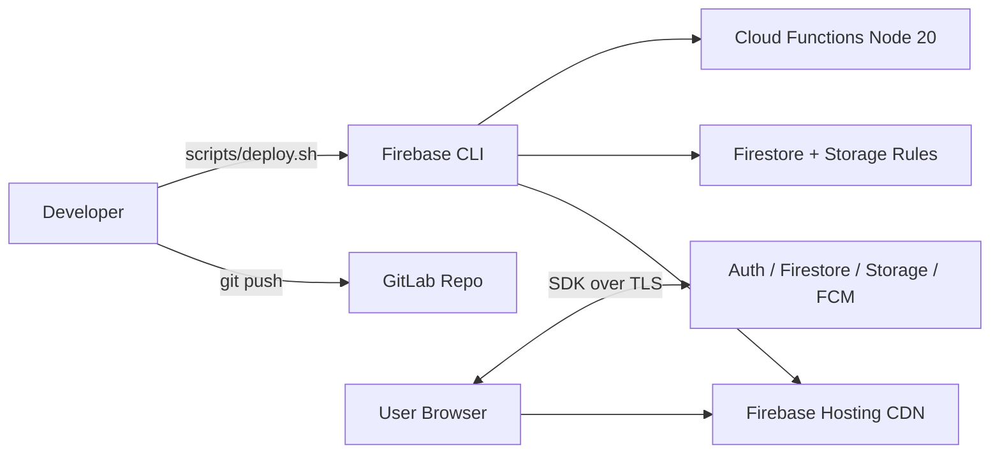
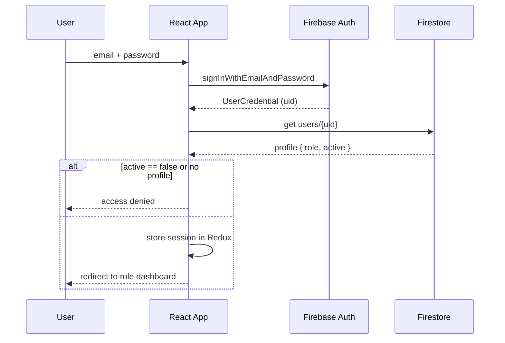
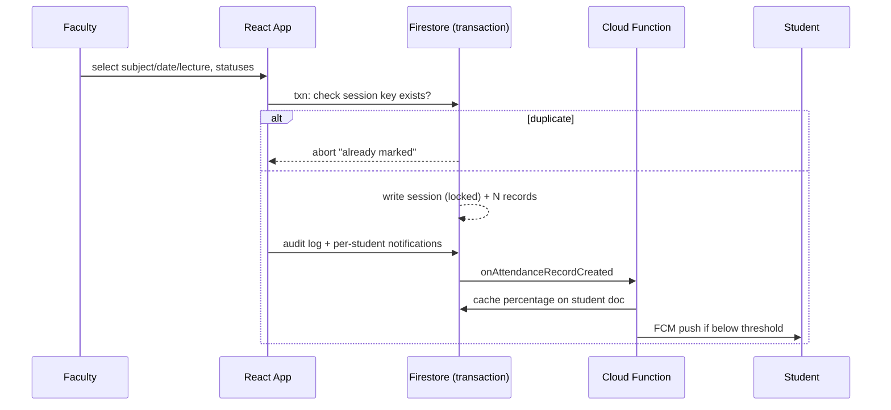
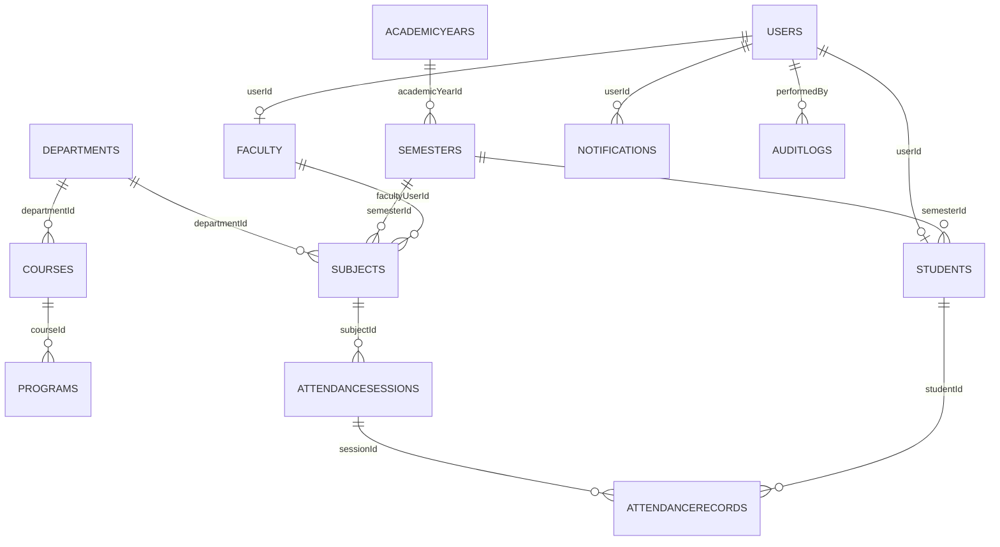

# System Architecture

## High-Level Architecture

```mermaid
flowchart LR
  subgraph Client["React 18 SPA (Vite + MUI + Redux Toolkit)"]
    UI[Pages & Components]
    Store[Redux Store]
    Services[Feature Services]
  end
  subgraph Firebase
    Auth[Firebase Authentication]
    FS[(Cloud Firestore)]
    ST[(Cloud Storage)]
    CF[Cloud Functions]
    FCM[Cloud Messaging]
    H[Firebase Hosting]
  end
  UI --> Store --> Services
  Services -->|SDK| Auth
  Services -->|SDK + realtime listeners| FS
  Services -->|uploads/downloads| ST
  FS -->|triggers| CF
  CF -->|push| FCM --> Client
  H -->|serves| Client
```

## Low-Level / Component Diagram

```mermaid
flowchart TD
  subgraph features
    auth[auth: slice + service + pages]
    admin[admin: entityConfigs + EntityManager + dashboard]
    faculty[faculty: mark/history/defaulters/search]
    student[student: dashboard/attendance/profile]
    attendance[attendance: engine service + slice]
    notifications[notifications: service + slice + bell]
    reports[reports: reportService + exportService + pages]
  end
  subgraph shared
    guards[ProtectedRoute / RoleRoute]
    layout[AppLayout / Sidebar / Navbar]
    common[DataTable / StatCard / Dialogs]
    fsvc[firestoreService]
    audit[auditService]
  end
  admin --> fsvc
  faculty --> attendance --> fsvc
  student --> attendance
  reports --> fsvc
  notifications --> fsvc
  attendance --> audit
  admin --> audit
  auth --> guards
```

## Deployment Diagram

```mermaid
flowchart LR
  Dev[Developer] -->|git push| GitLab[GitLab Repo]
  Dev -->|scripts/deploy.sh| CLI[Firebase CLI]
  CLI --> Hosting[Firebase Hosting CDN]
  CLI --> Rules[Firestore + Storage Rules]
  CLI --> Funcs[Cloud Functions Node 20]
  Browser[User Browser] --> Hosting
  Browser <-->|SDK over TLS| FirebaseSvcs[Auth / Firestore / Storage / FCM]
```

## Authentication Flow

```mermaid
sequenceDiagram
  participant U as User
  participant App as React App
  participant FA as Firebase Auth
  participant FS as Firestore
  U->>App: email + password
  App->>FA: signInWithEmailAndPassword
  FA-->>App: UserCredential (uid)
  App->>FS: get users/{uid}
  FS-->>App: profile { role, active }
  alt active == false or no profile
    App-->>U: access denied
  else
    App->>App: store session in Redux
    App-->>U: redirect to role dashboard
  end
```

## Attendance Marking Sequence

```mermaid
sequenceDiagram
  participant F as Faculty
  participant App as React App
  participant FS as Firestore (transaction)
  participant CF as Cloud Function
  participant S as Student
  F->>App: select subject/date/lecture, statuses
  App->>FS: txn: check session key exists?
  alt duplicate
    FS-->>App: abort "already marked"
  else
    FS-->>FS: write session (locked) + N records
    App->>FS: audit log + per-student notifications
    FS->>CF: onAttendanceRecordCreated
    CF->>FS: cache percentage on student doc
    CF->>S: FCM push if below threshold
  end
```

## Firestore Architecture

```mermaid
erDiagram
  USERS ||--o| FACULTY : "userId"
  USERS ||--o| STUDENTS : "userId"
  DEPARTMENTS ||--o{ COURSES : departmentId
  COURSES ||--o{ PROGRAMS : courseId
  ACADEMICYEARS ||--o{ SEMESTERS : academicYearId
  DEPARTMENTS ||--o{ SUBJECTS : departmentId
  SEMESTERS ||--o{ SUBJECTS : semesterId
  FACULTY ||--o{ SUBJECTS : facultyUserId
  SEMESTERS ||--o{ STUDENTS : semesterId
  SUBJECTS ||--o{ ATTENDANCESESSIONS : subjectId
  ATTENDANCESESSIONS ||--o{ ATTENDANCERECORDS : sessionId
  STUDENTS ||--o{ ATTENDANCERECORDS : studentId
  USERS ||--o{ NOTIFICATIONS : userId
  USERS ||--o{ AUDITLOGS : performedBy
```
